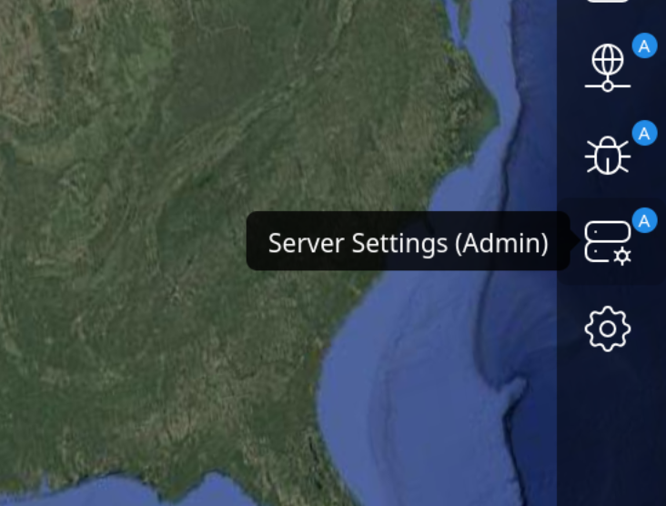
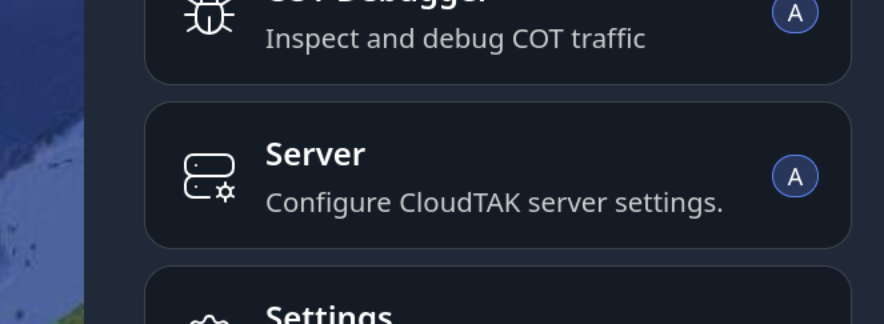
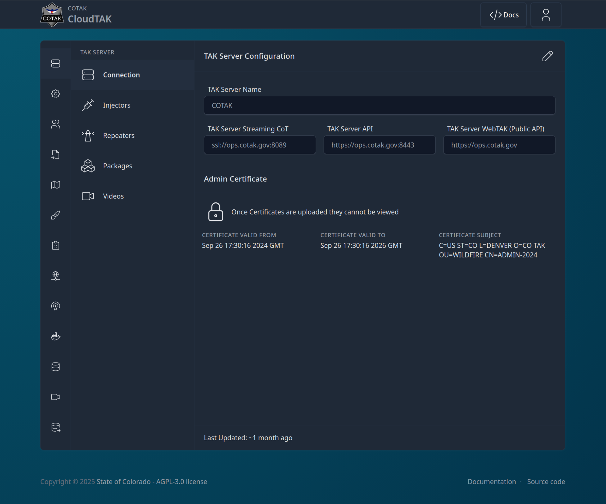
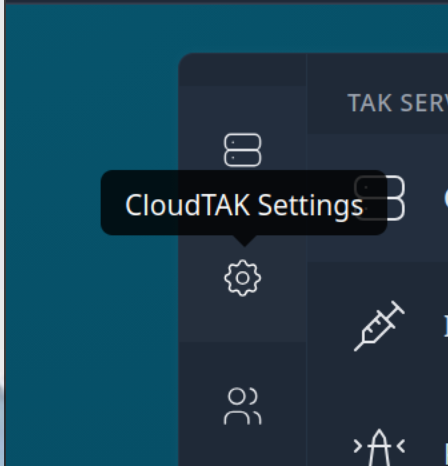
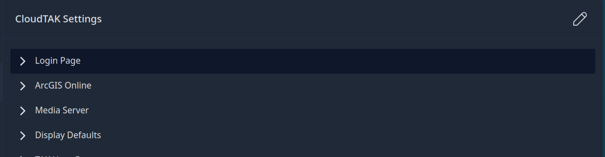
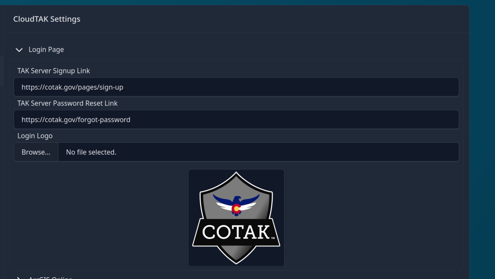

# CloudTAK Server Administration Guide

## Introduction

Welcome to the CloudTAK Server Administration Guide. This document provides comprehensive instructions for configuring, and managing the CloudTAK server.
Whether you are a system administrator or a technical user, this guide will help you ensure that your CloudTAK server is running smoothly and efficiently.

## Admin Panel

The admin panel can be accessed once logged in to the CloudTAK Map View.

| Large Device Side Menu                    | From within the Main Menu                 |
| ----------------------------------------- | ----------------------------------------- |
|  |  |

Once you enter the Admin Panel, you will get a screen like the following:

## CloudTAK Settings

The CloudTAK Settings section of the Admin Panel allows you to configure the default behavior of the CloudTAK server instance.

From the Admin Page, select the CloudTAK Settings Menu Item on the left:

### Server Branding

CloudTAK can be configured to use a custom logo and naming scheme to more easily identify and customize the server to fit your agency.

To configure, select the "Login Page" option and then the Pencil icon in the upper right-hand corner to edit.

Add any or all of the options you wish to customize and then select "Save Setting" in the bottom right.

## Connections & Data/ETL Integrations
